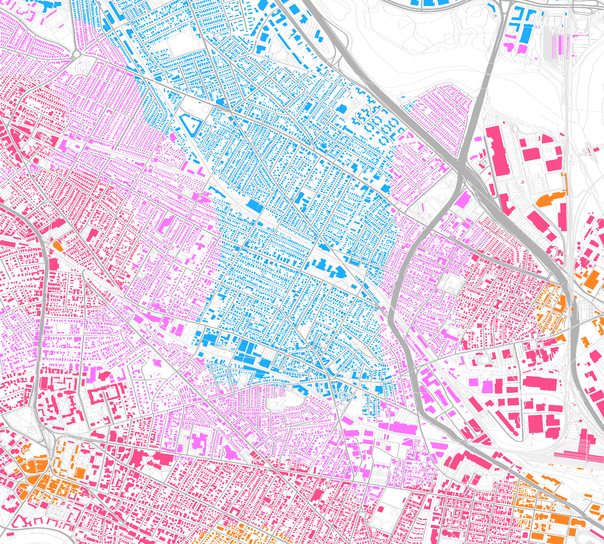
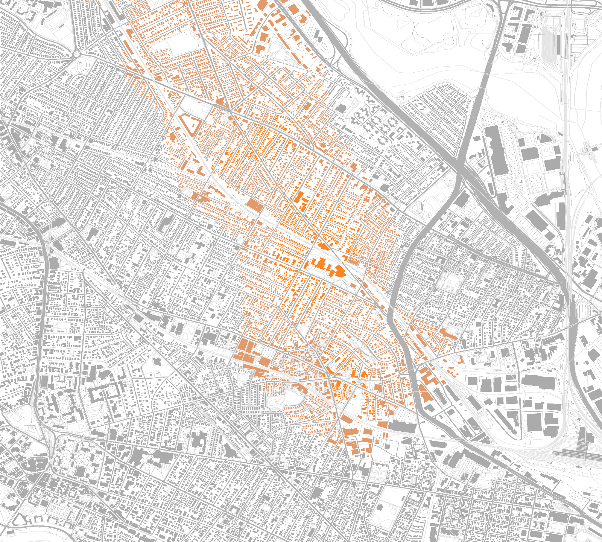
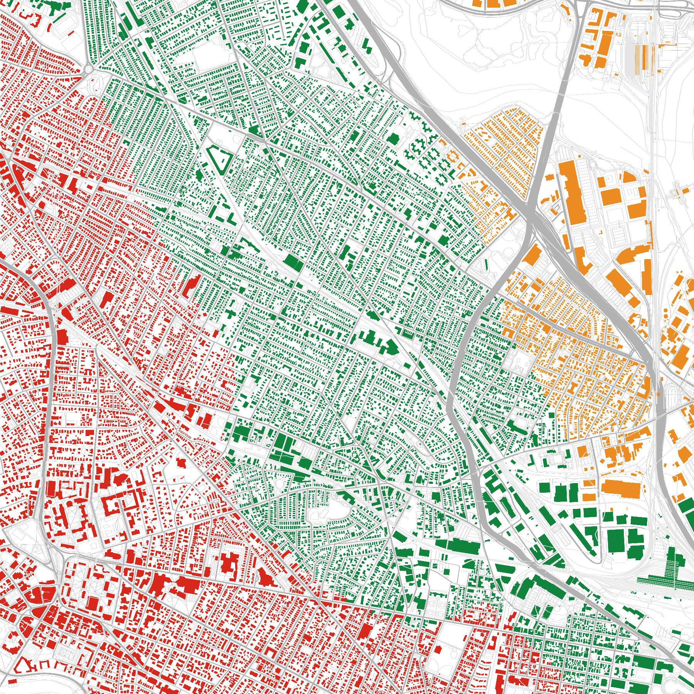

# Analyzing the Green Line Extension with OpenStreetMap

This presentation chronicles my attempts to use Rust to understand how the Green Line Extension will affect commutes in Somerville.


This map shows relative transit times to downtown.

## About the GLX

The Green Line Extension will add seven new stations to the north end of the MBTA green line. It will cost about $3 billion and is slated for completion about two years from now.


[Map](https://commons.wikimedia.org/wiki/File:Green_Line_Extension.svg) Courtesy Wikipedia user Pi.1415926535, CC-BY-SA 3.0


I want to look at how much the Green Line will change transit times from Somerville to downtown Boston.

## 🐃 Yak Shaving 🐃 

I'd like to analyze transit times... so I clearly need to write an OpenStreetMap file ingester and a GPU-based map renderer!?

- Ingester
- Renderer
- Glue

## OpenStreetMap

OpenStreetMap is like Wikipedia for geographical data. Besides literally streets, it contains over 5 billion buildings, parks, train tracks, trees, benches, and much more. This data set powers many maps that you see around the Internet.

## Getting the data

[Geofabrik GmbH](http://download.geofabrik.de/) provides downloads of various regions, down to U.S. states. I chose to download the Massachusetts data in `.pbf` format, The data is is encoded with Google's protocol buffers, a binary
encoding format. 

## OSM technical

I make use of two OSM concepts:

* A *node* is basically a point in space with a lat/long
* A *way* is a list of nodes, e.g. road, building, really anything that's not a point

## Interpreting the data

## Nodes

Data:

- ID
- latitude + longitude 
- Key-value tags, e.g. `amenity`: `vending_machine`, `vending`: `public_transport_tickets`

## Ways

Data:

- ID
- List of nodes
- Key-value tags, e.g. `highway`: `tertiary`, `name`: `Pearl Street`
- Attribution

## OSM PBF format

This is a protocol buffer format for efficiently storing OSM data.

It uses a few neat tricks:

- Splitting each file into blocks to allow parallel processing
- Storing data in columnar formats
- Referring to nodes and strings by ID (string interning)
- Delta-encoding sequences of ints (saves space)

## Splitting into blocks

The file is organized in triplets:

```
- #1 block header size in bytes
- #1 block header
- #1 block
- #2 block header size in bytes
- #2 block header
- #2 block
...
```

```protobuf
message BlobHeader {
  required string type = 1;     <- There are multiple types of blocks
  ...
  required int32 datasize = 3;  <- The size of the upcoming block
}
```

## Columnar data in protobuf

A new trick for me! Each array is the same length:

```protobuf
message DenseNodes {
   repeated sint64 id = 1 [packed = true];

   optional DenseInfo denseinfo = 5;

   repeated sint64 lat = 8 [packed = true];
   repeated sint64 lon = 9 [packed = true];

   // Alternates key, value, key, value, ...
   repeated int32 keys_vals = 10 [packed = true]; 
}
```

Since proto3, scalar numeric fields are packed by default.

## Delta-encoding IDs

Original data: `100`, `101`, `103`, `104`

Delta-encoded: `100`, `1`, `2`, `1`

Why is this good? With protobuf varints, the space required to encode an integer is proportional to the log of its size. Since OSM contains over 5 billion nodes, we're probably encoding most ints in 1 byte instead of 5 bytes, saving 80% space!

## Ingesting the data

I made my own ingester for OSM PBF data! Not sure if that was a good idea.

Challenges:

- The OSM PBF format is a little chaotic, having evolved over time
- Keeping up with the performance tricks
- I needed many layers of mapping, filtering and flat mapping

Yeah, it probably wasn't a good idea. Although I had trouble using the `osmpbf-reader` crate, I'd like to try the `osmpbf` crate.

## Optimizing ingestion

Because the file is split into blocks, I was able to decode each block individually, resulting in a huge speedup.

## The actual analysis

My model of a typical commute is:

1. Walk to the station
2. Wait for the train
3. Train goes downtown

In this model, each resident chooses the station that will result in the lowest total transit time.

Possible extensions:

- Other destinations. For example, Harvard, MIT, and Kendall are huge employment centers.
- Consider other modes of transport
- Analyze a larger geographic region

## Walking Times

"As the crow flies" with a constant penalty to account for the fact that people don't fly.

I expect this to introduce some error, especially near difficult-to-pass objects like I-93 and McGrath Highway.

Possible extension: pathfinding with actual sidewalk data

## Transit time from station to downtown

I have defined "downtown" as, "Park Street or Downtown Crossing, whichever is closer."

**Existing lines:** use schedules, test calibration by hand

**GLX:** measure distance between stations, comparing to existing D branch of the Green Line. I'm assuming that the trains will move at the same average speed, 19 MPH, because the density of stations is not too far off (thanks JBR!).

After doing this, I found a copy of the 2009 [Draft Environmental Impact Report](http://www.somervillestep.org/files/GreenLineDEIR_text_1009.pdf) which thankfully confirmed the sanity of these estimates.

## Estimated Transit Times

Measured in minutes to Lechmere.

- Lechmere: 0
- Union: 3 (DEIR: 4.5)
- E. Somerville: 3 (no DEIR)
- Gilman: 5 (DEIR: 5)
- Magoun: 6 (DEIR: 7)
- Ball: 9 (DEIR: 8.5)
- College Ave. 10 (DEIR: 10.25)

## Wait times

I also estimated the typical wait time between trains at each station.

On the low end, Lechmere will have an expected wait only of 2 minutes since it's on both Green Line branches. On the high end, the orange line is more like 9 minutes.

Possible extension: incorporate subway on-time performance

## Finding the best station for a given location

Currently: simply try each station for the given location and use the best one. This isn't always the *closest* station: for example, if you're halfway between Porter and Magoun, traveling through Porter will be a bit faster.

Possible extension: use heuristics to consider fewer stations

# Rendering a map

Goals: produce useful and informative maps of the Somerville area.

Two tricky problems here:

1. What do I want to draw?
2. How do I draw it?

## What do I want to draw?

The map should:

1. show the new, old, and/or difference in travel time, in addition to perhaps tracks, stations and other physical features relevant to transit
2. orient me
3. look good

## Drawing with Rust

Rust's 2D graphics landscape is evolving rapidly!

*[A Guide to Rust Graphics Libraries](https://wiki.alopex.li/AGuideToRustGraphicsLibraries2019?utm_source=share&utm_medium=ios_app), As of May 2019* (author of ggez, so this is from the perspective of games)

What graphics API? `wgpu-rs` because I am a library hypebeast.

## [wgpu-rs](https://github.com/gfx-rs/wgpu-rs)

Back ends: Vulkan, Metal, and DirectX

The successor to the deprecated `gfx` crate

Strongly inspired by Vulkan, but with a compatibility layer to work with Metal and DirectX. Higher-level than `gfx-hal`

## Selecting colors for graphics

Selecting a good color palette is important for clarity and accessibility.

I'm using the [`palette`](https://github.com/Ogeon/palette) crate for color space math. 

Starting with CIE L\*a\*b\* color space, designed to be perceptually uniform.

To specify colors by hand, using CIE L\*C\*h°, a cylindrical version of that space. 

Use color palettes friendly to color blind people, i.e. don't contrast red vs. green.

I was highly inspired by [Color Schemes](https://programmingdesignsystems.com/color/color-schemes/index.html) from 
*Programming Design Systems*, a free digital book by Rune Madsen.

## Misc. Graphics

I used `lyon` to tesselate my graphics (i.e. to turn everything into triangles)

I wrote simple GLSL shaders and compiled them to Vulkan with `shaderc`.

# Results



Colors:

- Orange: 5–23 minutes
- Red: 12–30 minutes
- Pink: 20-38 minutes
- Blue: 28-45 minutes

Let's use an uncertainty of 5 minutes: think about headway, train delays, and modeling inaccuracies 

There is an underserved corridor in central and northern parts of Somerville.


Now that corridor is better-served. 👍



How much better-served? In this map, the data ranges from 0 to 20 minutes. The highest deltas can be seen in Union Square, Gilman Square, and southeast of Magoun Square.



This map shows the best MBTA line for each location. This shows that a large chunk of Somerville will be "on the green line." 

# End

## Recap

I used [OpenStreetMap](http://openstreetmap.org/) and [wgpu-rs](https://github.com/gfx-rs/wgpu-rs) to analyze MBTA's upcoming Green Line Extension with Rust.

## Data Pipeline

- 1a: Deserialize OSM data with `protobuf` and `rayon`
- 1b: Parse station data with `csv`
- 2a: Translate from lat/long with `geo`
- 3a: Generate shapes
- 3b: Generate colors with `palette`
- 4: Tesselate shapes with `lyon`
- 5: Render map with `wgpu`

## Acknowledgements

- Wikipedia, as usual
- Google Maps is a nice way to double-check results
- OpenStreetMap

# Notes

## TODO before presentation

- Be able to render all of Somerville
- "Complete" presentation
- Add a legend or numerical labels 

## TODO after release

- Add title and legend
- Draw background, not houses
- Draw borders on un-drawn area
- Use correct depth... relations?
- Fix horizontal-vertical squashing
- Render in whole screen

## Map/design inspiration

- [Leaflet](https://leafletjs.com/): A nice JS renderer for OSM data. Looks like this is what's used on OSM's site. The text is pretty aliased and it's a bit noisy.
- [MapBox Light & Dark Maps](https://www.mapbox.com/maps/light-dark/): Elegant pixel-perfect maps
- http://sotm-eu.org/slides/79.pdf <- link broken?
- [MBTA Map + Proposal](http://cyrusdahmubed.com/mbta-map) by Cyrus Dahmubed: An MBTA map with some neat twists
- [New MBTA Red Line Vehicles](https://cdn.mbta.com/sites/default/files/2018-08/new-red-line-vehicles-brochure.pdf)
- [*How Boston Got Its ‘T’*](https://www.citylab.com/design/2018/09/how-boston-got-its-t/570004/) from CityLab: 